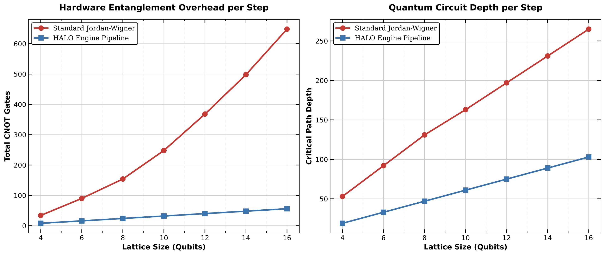
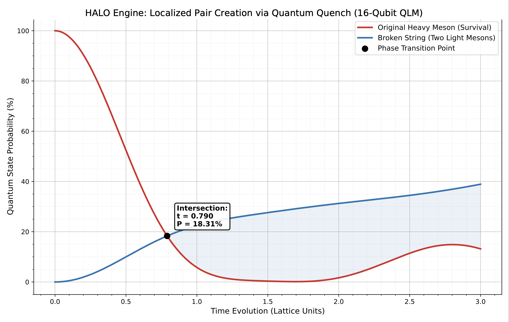
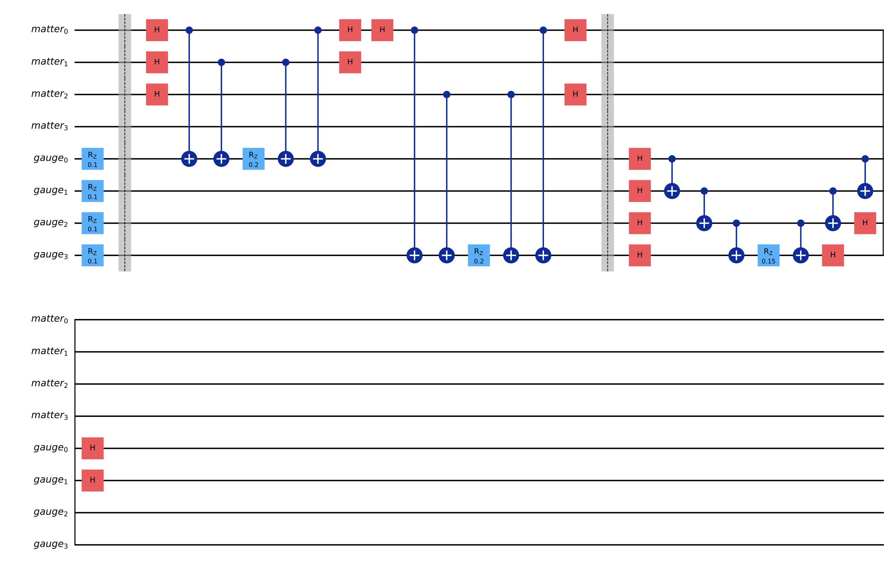

# ⚡ HALO Engine (Hardware-Aware Lattice Optimization)

[](https://arxiv.org/abs/2608.19243)
[](https://opensource.org/licenses/MIT)

A highly optimized quantum compiler and simulation framework for observing Lattice Gauge Theories (LGTs) on near-term physical quantum hardware. 

The HALO framework completely bypasses the severe $\mathcal{O}(N)$ circuit depth overheads associated with standard Jordan-Wigner transformations by natively mapping composite gauge links to the hardware topology. By achieving an asymptotic circuit depth of **$\mathcal{O}(1)$ per Trotter step**, this engine enables deep-time quantum simulations and variational ground-state preparation previously inaccessible on noisy processors (demonstrated on IBM Heron r2 architectures using native `cz` gates).

This repository contains the core compiler library, quickstart tutorials, and the complete suite of benchmarking scripts used to generate the physics data for the associated publication.

## Hardware Specifications & Conventions (v2)
To ensure absolute academic transparency and reproducibility, this repository and the associated manuscript adhere to the following hardware-level specifications:
* **IBM Heron Architecture:** All physical QPU executions were routed to the 156-qubit `ibm_marrakesh` (20-qubit VQE, 10-qubit ZNE) and `ibm_fez` (16-qubit phase dynamics) processors.
* **Native Basis Gates:** The compiler strictly optimizes for the IBM heavy-hex native basis `['cz', 'rz', 'sx', 'x']`.
* **Qiskit Endianness:** All bitstrings, probability distributions, and statevectors strictly follow Qiskit's standard **little-endian** convention (i.e., qubit 0 is the rightmost bit: $\vert{}q_{N-1} \dots q_1 q_0\rangle$).

## Key Scientific & Algorithmic Achievements

* **Multi-Strategy Compiler Benchmarking:** Validated $\mathcal{O}(1)$ scaling against standard Jordan-Wigner and Explicit Gauge encodings at Qiskit Optimization Levels 1 and 3.
* **16-Qubit Hardware Dynamics:** Successfully simulated the real-time dynamics of heavy meson string breaking on IBM's 16-qubit heavy-hex topologies.
* **Dynamical Phase Diagrams:** Mapped the critical non-equilibrium phase transition between the non-perturbative Confinement Regime and the Kinetic Dispersion (Free Fermion) regime.
* **Zero-Noise Extrapolation (ZNE):** Exploited the localized nature of the HALO mapped Pauli strings to achieve a noise scaling factor of $\lambda = 3$ with only a ~2.5x hardware depth penalty, recovering exact continuous-time physics.
* **20-Qubit VQE Convergence:** Validated Variational Quantum Eigensolver (VQE) for interacting vacuum state preparation at an unprecedented scale of 20 qubits.
* **2D Lattice Extensibility:** The native hardware-aware mapping is fundamentally extensible to 2D unit cells, laying the groundwork for higher-dimensional QED and QCD simulations.

## Visual Benchmarks

### 1. The Compiler Duel: $\mathcal{O}(1)$ vs $\mathcal{O}(N)$ Scaling
By bypassing non-local parity chains, HALO flatlines the critical path depth per Trotter step. This provides a massive hardware advantage over standard Jordan-Wigner transformations—dominating both baseline (unoptimized) and heavily optimized (Opt-Level 3) Qiskit transpilation pipelines—allowing for arbitrary scaling of the spatial lattice size without incurring depth-induced decoherence penalties.
<p align="center">
  
</p>

### 2. Physical Observation of Localized String Breaking (16-Qubit QLM)
Time-evolution of the Schwinger model tracking the decay of a heavy meson into two localized light mesons (string breaking) across the hardware array.
<p align="center">
  
</p>

### 3. Native 2D Unit Cell Extensibility
Unlike 1D string-to-qubit mappings, the HALO framework's localized composite links natively map to 2D planar hardware topologies, paving the way for higher-dimensional gauge theories.
<p align="center">
  
</p>

## Repository Structure

```text
HALO-Engine/
├── data/                        # Historical IBM QPU execution logs
│   └── halo_ibm_executions.json # Raw API Job IDs for 100% data provenance
├── halo/                        # Core Python library
│   ├── compiler.py              # Hardware-aware transpilation pipeline
│   ├── hamiltonian.py           # O(1) Hamiltonian builder
│   ├── mitigation.py            # Digital ZNE and Lindblad extrapolation
│   └── vqe.py                   # Physics-informed interacting vacuum ansatz
├── notebooks/                   # Interactive environments
│   ├── halo_quickstart_tutorial.ipynb  # Intro to the HALO framework
│   └── reproduce_figures.ipynb         # Historical API retrieval & reproduction
├── benchmarks/                  # Publication-grade plotting and execution scripts
├── figures/                     # Auto-generated outputs for plots and architectures
├── requirements.txt             # Exact environment dependencies
├── LICENSE                      # MIT Open Source License 
└── README.md
```
## Quickstart

**1. Clone the repository:**
```bash
git clone https://github.com/stark-069/HALO-Engine.git
cd HALO-Engine
```
**2. Set up the Python environment:**
```bash
python3 -m venv .venv
source .venv/bin/activate
pip install -r requirements.txt
```
**3. Run the interactive tutorial:**
```bash
jupyter notebook notebooks/halo_quickstart_tutorial.ipynb
```
## Reproducing Publication Benchmarks & QPU Data
This repository guarantees Data Availability. You can reproduce the exact historical QPU measurements published in the manuscript using the IBM Quantum API.
**To retrieve historical hardware data: **
Launch Jupyter and open the reproduction notebook to fetch the original August 2026 measurements directly from the IBM Cloud using the job IDs stored in `data/halo_ibm_executions.json`:
```bash
jupyter notebook notebooks/reproduce_figures.ipynb
```

**To generate analytical plots locally:**
Run the standalone benchmarking scripts from the root directory (e.g., to generate Table I and Figure 1):

```bash
python benchmarks/01_compiler_scaling_benchmark.py
```
All resultant data and plots will automatically save to the `/figures` directory.

## Citation

If you utilize the HALO Engine, its compiler methodologies, or the physical data in your research, please cite our work:

```bibtex
@article{gohar2026halo,
  title={The HALO Engine: O(1)-Step Compilation and Localized String Rupture for Lattice Gauge Theories on Quantum Hardware},
  author={Gohar, Abhiroop},
  journal={arXiv preprint arXiv:2608.19243},
  year={2026}
}
```
## Author & Contact

**Abhiroop Gohar**  
*Undergraduate, Engineering Physics*  
*Indian Institute of Technology (IIT) Indore*  

For academic collaborations, discussions regarding the HALO framework, or research opportunities, feel free to reach out:

* **Email:** ep240051002@iiti.ac.in
* **GitHub:** [@stark-069](https://github.com/stark-069)
